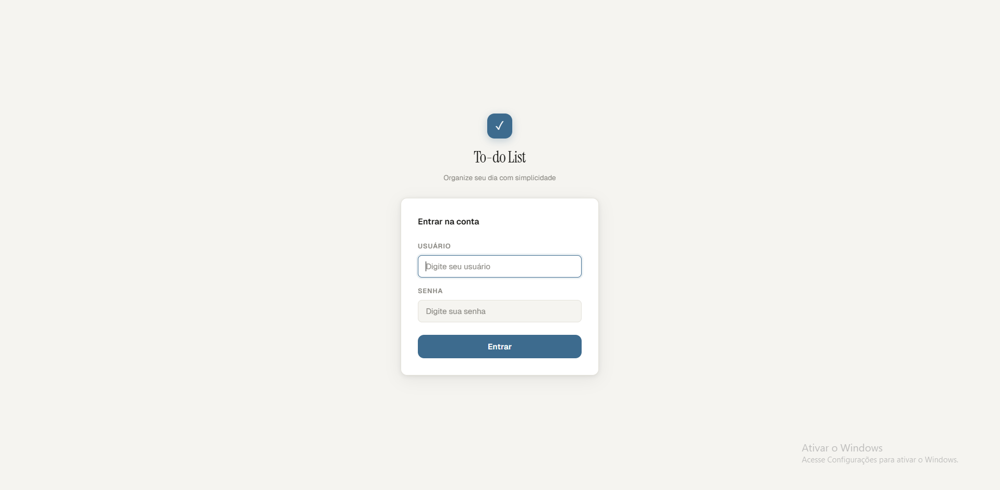
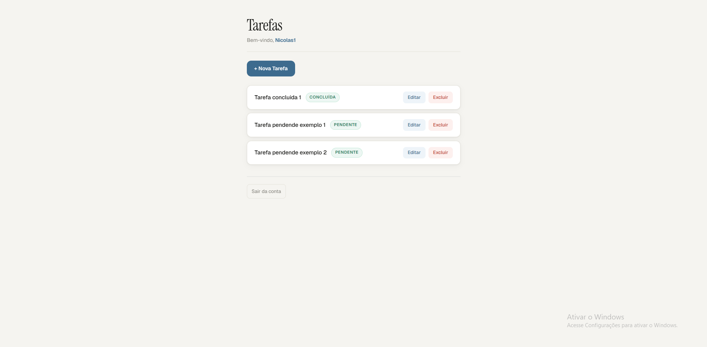
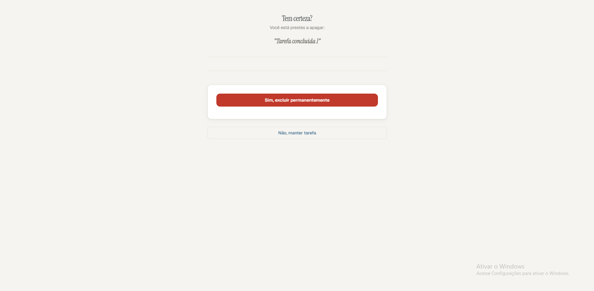

# Lista de Tarefas

Gerenciador de tarefas desenvolvido com Django, com autenticação de usuários e
operações completas de CRUD. Cada usuário acessa apenas suas próprias tarefas.

## Funcionalidades

- Login e logout com autenticação via Django Auth
- Criar, editar e excluir tarefas
- Marcar tarefas como concluídas ou pendentes
- Acesso restrito: Apenas usuários autenticados visualizam suas listas
- Interface responsiva

## Tecnologias

- Python 3 + Django (Class-Based Views)
- HTML5 + CSS3
- SQLite
- Django Contrib Auth

## Screenshots






## Como rodar localmente
```bash
git clone https://github.com/NicolasRenck/lista-de-tarefas
cd lista-de-tarefas
python -m venv venv
venv\Scripts\activate  # Windows
pip install -r requirements.txt
python manage.py migrate
python manage.py runserver
```

## Criando um superusuário
```bash
python manage.py createsuperuser
```